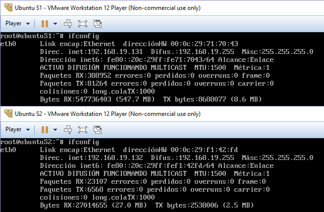
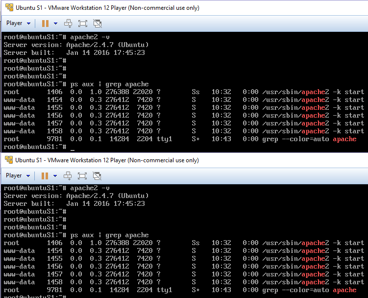

Práctica 1 - Presentación de las prácticas y preparación de las herramientas
============================================================================
Antonio Doncel Campos
----------------------------------------------------------------------------

**Como resultado de la práctica 1 se mostrarán las máquinas funcionando al profesor en
clase. Asimismo, se debe copiar el resultado de ejecutar los siguientes comandos en
el terminal:**

* **apache2 -v**
* **ps aux | grep apache**

Se ha realizado la instalación de dos máquinas virtuales en VMWare Workstation, se ha usado el S.O. Ubuntu 14.04 Server y se han configurado como indica el guión de la práctica obteniendo el siguiente resultado.

