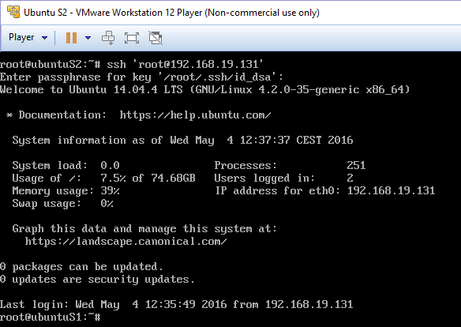

Práctica 2 - Clonar la información de un sitio web
==================================================
Antonio Doncel Campos
--------------------------------------------------

**En esta práctica el objetivo es configurar las máquinas virtuales para trabajar en modo
espejo, consiguiendo que una máquina secundaria mantenga siempre actualizada la
información que hay en la máquina servidora principal.**

**Hay que llevar a cabo las siguientes tareas:**
	* Probar el funcionamiento de la copia de archivos por ssh
	* Clonado de una carpeta entre las dos máquinas
	* Configuración de ssh para acceder sin que solicite contraseña
	* Establecer una tarea en cron que se ejecute cada hora para mantener actualizado el contenido del directorio /var/www entre las dos máquinas

**Como resultado de la práctica 2 se mostrará al profesor el funcionamiento del proceso
de clonado de la información. En el documento a entregar se describirá cómo se ha
realizado la configuración de ambas máquinas y del software.**

En primer lugar se ha realizado una copia manual de un servidor a otro.

Después se ha procedido a instalar la herramienta rsync para la clonación de carpetas
y se ha comprobado su funcionamiento.

Se ha creado una clave SSH para la conexión entre servidores sin necesidad de contraseña,
lo cual nos facilitará las copias y nos permitirá programarlas.

Por último se ha modificado el archivo contrab para planificar la tarea de copias de seguridad
del servidor principal. Se realizará una copia cada hora.

