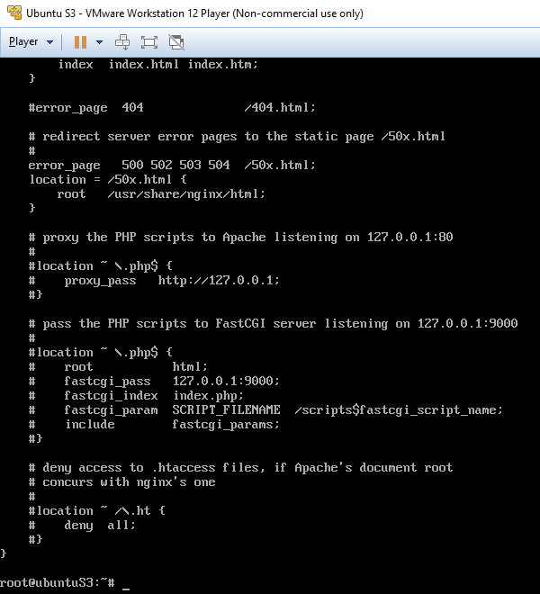
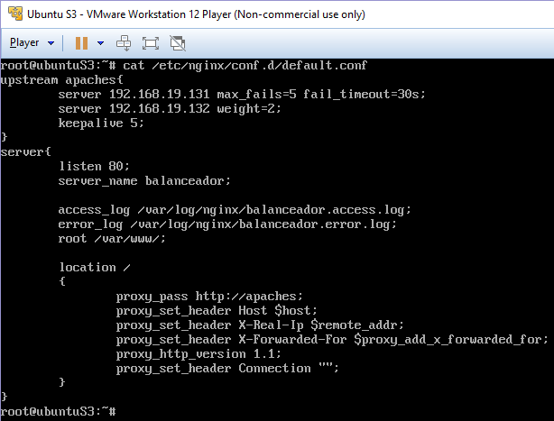
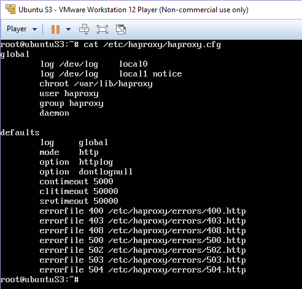
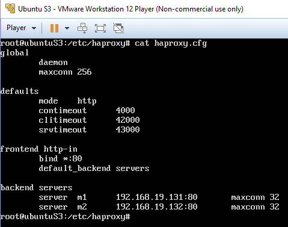

Práctica 3 - Balanceo de carga
==================================================
Antonio Doncel Campos
--------------------------------------------------

**En esta práctica se llevarán a cabo, como mínimo, las siguientes tareas:**
* **Configurar una máquina e instalarle el nginx como balanceador de carga**
* **Configurar una máquina e instalarle el haproxy como balanceador de carga**
	
**En ambos casos, debemos hacer peticiones a la dirección IP principal y comprobar
que realmente se reparte la carga.**

**Además, se comprobará el funcionamiento de los algoritmos de balanceo round-robin
y con ponderación (en este caso supondremos que la máquina 1 tiene el doble de
capacidad que la máquina 2).**

**Adicionalmente, y como tarea opcional para conseguir una mayor nota en esta
práctica, se propone el uso de algún otro software de balanceo diferente a los dos
explicados en este guión.**

**Como resultado de la práctica 3 se mostrará al profesor el funcionamiento del
balanceo de carga con los diferentes balanceadores. En el documento a entregar se
describirá cómo se ha realizado la configuración de ambas máquinas y del software.**

Para esta práctica ha sido necesario configurar una máquina virtual nueva, también con
Ubuntu 14.04 Server, que actúe como balanceador de carga.

Después de su configuración procedemos a parar el servicio de apache ya que ocupa el puerto 80
y es necesario para realizar el balanceo.

Ahora instalaremos Nginx

y lo configuramos como nos indica el guión de la práctica.

Configuración por defecto:

Configuración propia:

Probamos su funcionamiento para asegurarnos de que está bien instalado y configurado y
efectivamente el balanceador reparte la carga entre los dos servidores.

Realizamos los mismos pasos con el balanceador haproxy. Antes se ha parado el servicio nginx
y se ha instalado el nuevo balanceador.

Configuración por defecto:

Configuración propia:

Comprobamos que haproxy también funciona correctamente.

