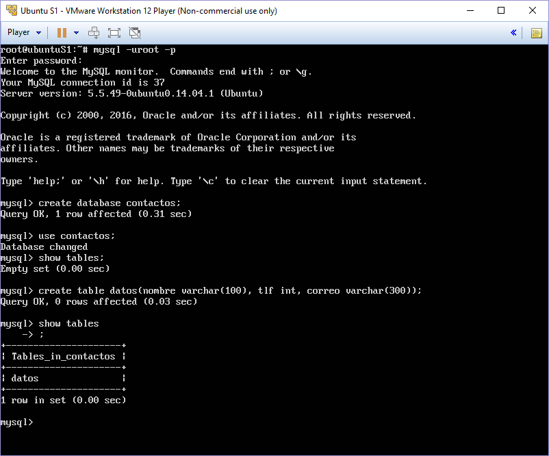
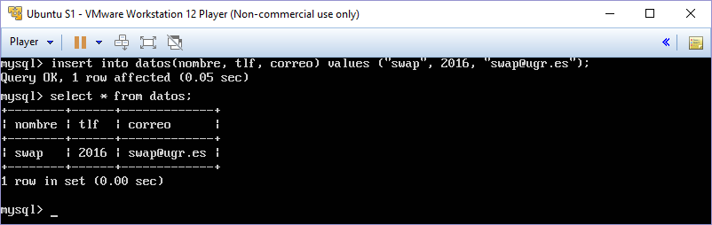
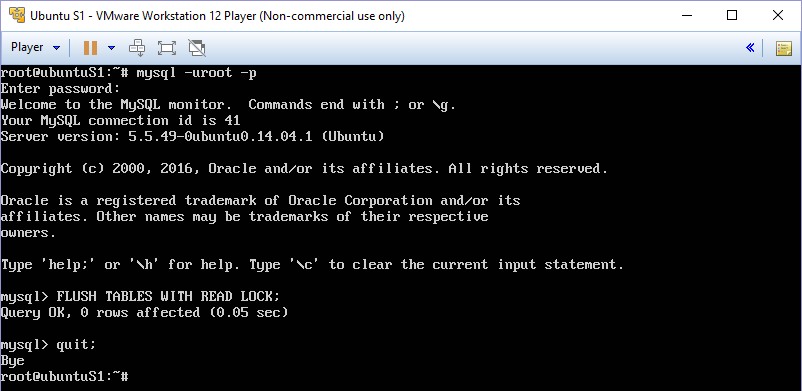
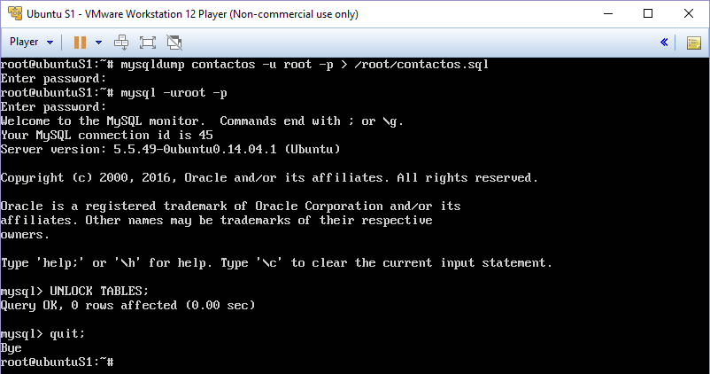
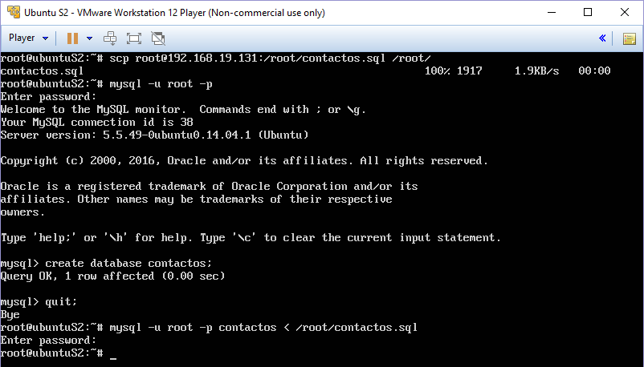
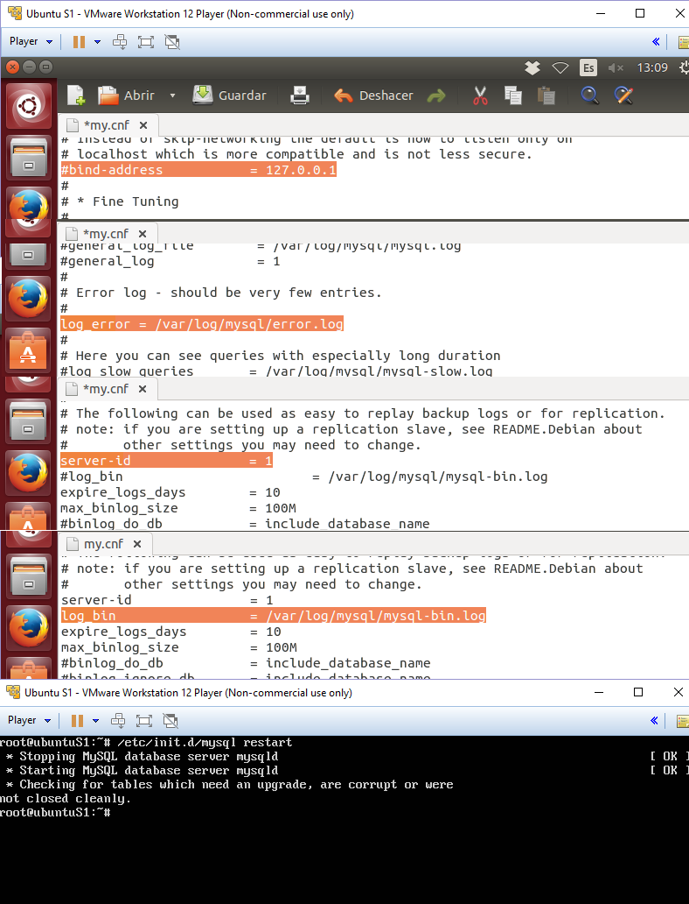
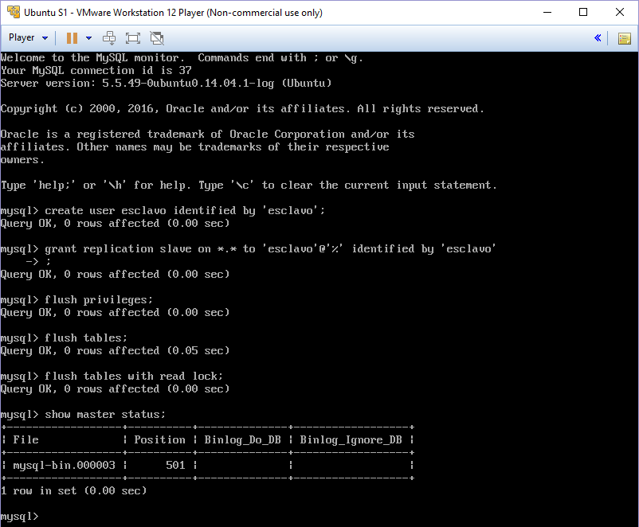
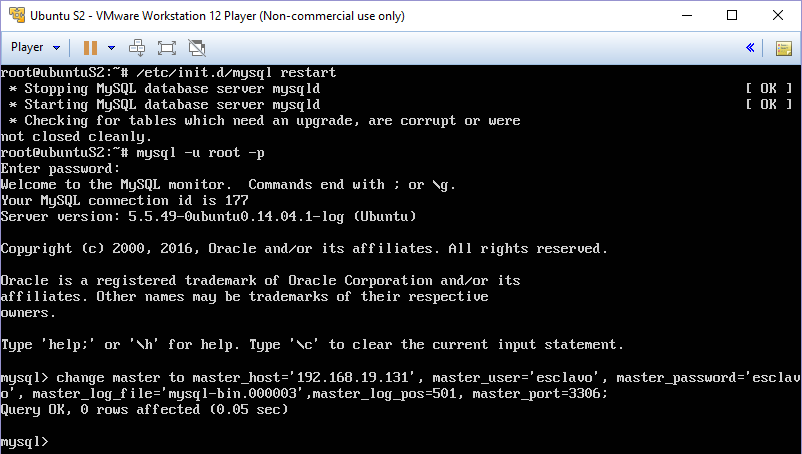
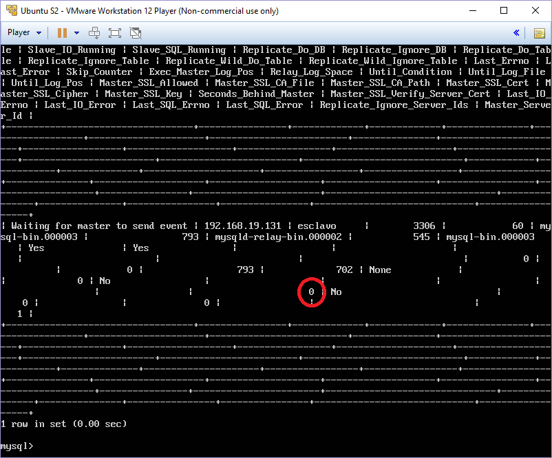
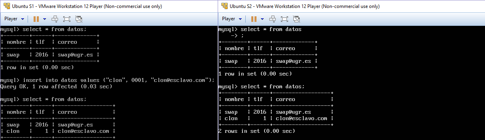

Práctica 5 - Replicación de bases de datos MySQL
==================================================
Antonio Doncel Campos
--------------------------------------------------

**En esta práctica el objetivo es configurar las máquinas virtuales para trabajar de forma
que se mantenga actualizada la información en una BD entre dos servidores (la
máquina secundaria mantendrá siempre actualizada la información que hay en la
máquina servidora principal).**

**Hay que llevar a cabo las siguientes tareas obligatorias:**
• Crear una BD con al menos una tabla y algunos datos.
• Realizar la copia de seguridad de la BD completa usando mysqldump.
• Restaurar dicha copia en la segunda máquina (clonado manual de la BD).
• Realizar la configuración maestro-esclavo de los servidores MySQL para
que lareplicación de datos se realice automáticamente.

**Adicionalmente, y como tarea opcional para conseguir una mayor nota en esta
práctica, se propone realizar la configuración maestro-maestro entre las dos máquinas
de bases de datos.**

**Como resultado de la práctica 5 se mostrará al profesor el funcionamiento del proceso
de clonado (manual y automático) de la información en la BD MySQL. En el
documento de texto a entregar se describirá en detalle cómo se ha realizado la
configuración de ambos servidores (configuraciones y comandos de terminal
ejecutados en cada momento)..**

Siguiendo las instrucciones del guion, hemos entrado en el modo comandos de MySQL con
el comando mysql -u root -p. Una vez ahí creamos la base de datos ya que no habrá ninguna creada.

Ahora crearemos una tabla en la que insertar datos

y le insertaremos algunos datos.

Como lo que queremos es mantener una copia de esos datos en el otro servidor debemos bloquear
las tablas para poder realizar la copia con mysqldump.

Ahora procedemos a realizar la copia y desbloquear las tablas de nuevo.

Con esto ya podemos copiar el archivo .sql mediante scp al otro servidor e insertarlo en
MySQL. Lo único necesario es crear la base de datos en el servidor2 ya que es la única acción
que no realiza por si solo.

Para que se realice la copia automáticamente y directamente en MySQL debemos configurar los servidores
como maestro y esclavo.

La configuración necesaria en el maestro es la siguiente.

Estas son las mismas configuraciones necesarias en el archivo esclavo, sustituyendo server-id = 2.
Como tenemos una versión de MySQL superior a la 5.5 la configuración del maestro se hará por
línea de comandos en MySQL. Pero primero debemos crear el usuario esclavo en el MySQL maestro.

Ahora configuramos el maestro en el servidor esclavo y mostramos el estado del esclavo.

Como la variable Seconds_Behind_Master, señalada en rojo, es distinto de null e igual a 0
no hay errores y se supone que deberia funcionar bien por lo que vamos a probarlo.

