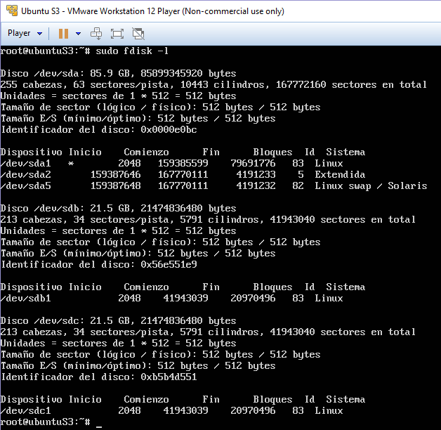
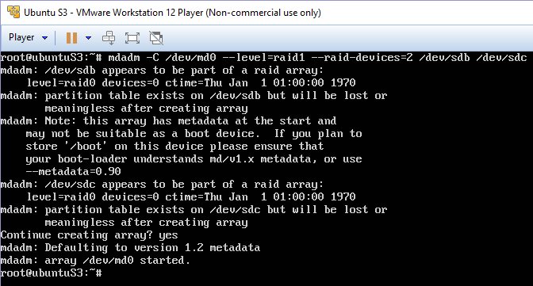
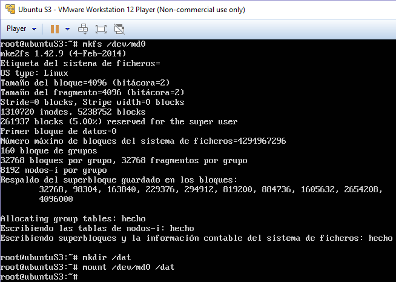
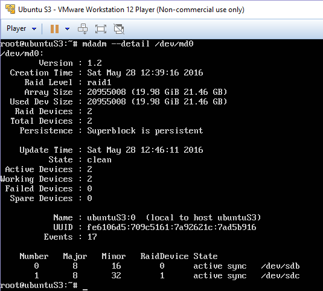
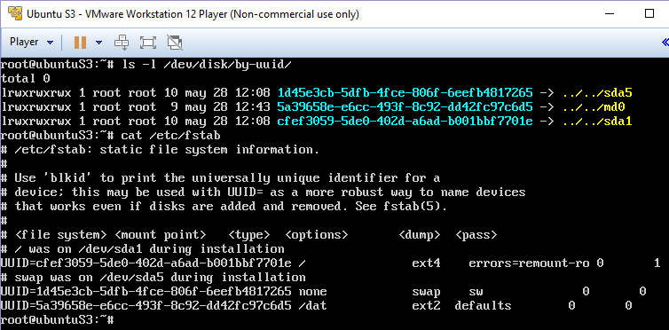
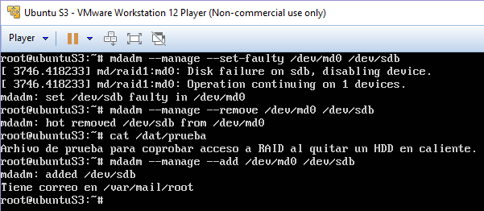

Práctica 6 - Discos en RAID
==================================================
Antonio Doncel Campos
--------------------------------------------------

**El objetivo de esta práctica es configurar varios discos en RAID 1.**

**Hay que llevar a cabo las siguientes tareas:**

* **Realizar la configuración de dos discos en RAID 1 bajo Ubuntu 12.04, automatizando el montaje del dispositivo creado al inicio del sistema.**
* **Simular un fallo en uno de los discos del RAID (mediante comandos con el mdadm), retirarlo “en caliente”, comprobar que se puede acceder a la información que hay almacenada en el RAID, y por último, añadirlo al conjunto y comprobar que se reconstruye correctamente.**

**Adicionalmente, y como tarea opcional para conseguir una mayor nota en esta práctica, se propone realizar una configuración de servidor NFS. La idea es que la máquina con el dispositivo RAID sea un servidor NFS y otra máquina monte dicha unidad usando este protocolo.**

**Como resultado de la práctica 6 se mostrará al profesor el funcionamiento de los discos configurados en RAID 1. En el documento de texto a entregar se describirá cómo se ha realizado la configuración (configuraciones y comandos de terminal a ejecutar en cada momento).**

En primer lugar para poder crear el RAID debemos añadir dos nuevos discos duros al sistema y darles formato.

Una vez que tenemos hecho eso podemos crear el RAID con mdadm y el comando indicado en el guión.

Cuando tenemos el RAID creado, creamos la carpeta donde vamos a montarlo para ir almacenando ficheros.

Comprobamos que el RAID está funcionando correctamente.

Con todo lo anterior hecho podemos ya configurar que el RAID se cree y se monte en el arranque del sistema como nos indica el guión de prácticas.

Por último y una vez todo correcto probamos a simular un fallo.
Como vemos al declarar un HDD como fallido lo deshabilita y continua todo el RAID en los HDD restantes, 1 en nuestro caso, por esto podemos retirar el disco fallido en caliente con total facilidad y sin afectar al RAID o a su contenido.

