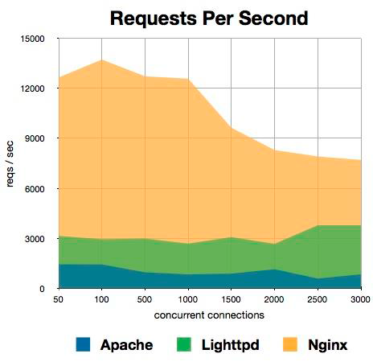
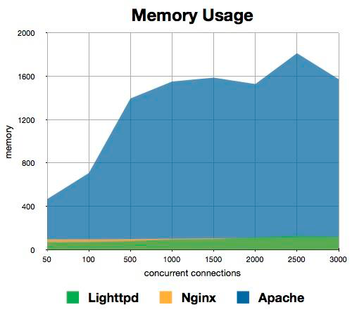

Ejercicios propuestos para el Tema 1
====================================
Antonio Doncel Campos
------------------------------------

**Buscar información sobre el tipo de contenido para el que los siguientes software de servidores web es mas adecuado**
(o mas eficiente, o se usa mas actualmente, etc.):

**APACHE**

Apache es el Servidor Web más utilizado, líder con el mayor número de instalaciones a nivel mundial muy por delante de otras soluciones como el IIS (Internet Information Server) de Microsoft.

Apache nos permite configurar un Hosting Virtual basado en IPs o en nombres, es decir, tener varios sitios web en un mismo equipo o establecer distintos niveles de control de acceso a la información incluyendo el soporte ha cifrado SSL utilizando protocolo seguro HTTPS.

También utilizando apache potenciamos la mejora del posicionamiento. El servidor web Apache junto con el módulo mod_rewrite puede convertirse en una herramienta muy útil crear páginas con enlaces amigables para los buscadores, es decir, http://dominio/soluciones/bonitas en vez de http://dominio/index.php?id=re345hfg&p=jf4.

**NGINX**

Prácticamente realiza las mismas funciones que apache con algunas diferencias.
Nginx es mucho más rápido y consume menos memoria que Apache como podemos ver en estas graficas:

	
	

Lo podemos usar junto al servidor Apache ya que Nginx no reproduce contenido dinámico como PHP, Phyton, Ruby, etc… por eso muchas empresas optan por usar Nginx para su contenido estático y Apache para el dinámico.

Puedes usar Nginx como caché, con algo de configuración, permitiendo mejorar la eficiencia de tu aplicación sin tocar la programación de la misma, además, este servidor web puede funcionar como balanceador de carga, distribuyendo el tráfico entre varios servidores, permitiendo mayor escalabilidad.

Nginx es compatible con una gran cantidad de CMS existentes en el mercado, y hay un sin fin de tutoriales y documentación para instalar bajo Nginx por ejemplo: Wordpress, Joomla, Drupal, phpBB, etc.

Actualmente es el 3º servidor web más usado del mundo.

**THTTPD**

Trivial HTTP Daemon o thttpd por conveniencia es un servidor de páginas web escrito 100% en Java. Se diseñó para ofrecer un medio donde compartir información, siendo seguro, fácil de instalar y configurar, así como altamente portable entre SO y arquitecturas.

Puede verse como un servidor de páginas “plug and play”, lo descomprimes, lo configuras y está listo para ser usado. Su bajo acoplamiento permite compartir archivos de cualquier tipo en cuestión de minutos y ser eliminado rápidamente si no es necesario.

Aunque se presenta como un “plug and play” necesita una serie de requerimientos de configuración para su uso:

*Java Rutime Environment, versión 1.5.0. El servidor fue escrito y probado utilizando la JDK 1.5.0 update 6.

*Configuración de cortafuegos (firewall) si existe uno, para permitir aceptar y responder a conexiones entrantes.
*Configuración de la propia aplicación.

La versión del servidor thttpd 2.0 soporta archivos de cualquier tipo, incluyendo imagenes, sonidos y música, entre otros.

**CHEROKEE**

Servidor web multiplataforma que compite directamente con Nginx en lo que a ligereza se refiere y además puede ser ampliable mediante módulos sin dejar de ser un servidor web muy rápido.

Cherokee Web Server tiene una excelente interfaz web desde la cual puedes configurar el servidor web, configurar los virtualhosts e incluso optimizar el servidor web para funcionar mejor, todo eso sin tener conocimientos sobre como introducir parámetros al servicio web en línea de comandos.

Cherokee Web Server puede ser actualizado en caliente sin necesidad de parar o reiniciar el servicio y la posibilidad de configurar PHP desde la interfaz web de forma detallada y sin necesidad de acceder mediante consola al php.ini para cambiar cualquier parámetro o limitación.

La interfaz web ofrece interesantes gráficos de estadísticas y uso de recursos, incluye herramientas y utilidades integradas para streaming de audio y video de forma optimizada adaptándose automáticamente a la velocidad de la conexión del visitante.

Al igual que Nginx, Cherokee Web Server puede ser implementado como balanceador de carga para otros servidores web y su velocidad de carga es casi tan alta como la de Nginx.

**NODE.JS**

Node.js es un entorno JavaScript de lado de servidor que utiliza un modelo asíncrono y dirigido por eventos, igual que se utiliza Ruby o Python en el servidor, ahora también se puede utilizar JavaScript.

Node.js está basado en el motor V8 de JavaScript de Google. Este motor está diseñado para correr en un navegador y ejecutar el código de JavaScript de una forma extremadamente rápida.

Básicamente Node.js es adecuado cuando necesitas hacer muchas cosas al mismo tiempo, sobre todo muchas operaciones I/O (acceso a ficheros, bases de datos,…) a la vez y es especialmente bueno para aplicaciones realtime, que necesitan mantener una conexión persistente entre el browser y el servidor (juegos online, chats, herramientas de colaboración, etc.).

Con Node.js puedes utilizar JavaScript como lenguaje de scripting en tu consola (como bash, perl, etc.), está basado en eventos, así que toda la filosofía asíncrona que ya utilizamos con AJAX en el cliente la podemos pasar al servidor, te permite utilizar el mismo lenguaje (javascript) tanto en el cliente como en el servidor y tiene muy buena gestión de paquetes gracias a NPM.

**TOMCAT**

Apache Tomcat (también llamado Jakarta Tomcat o simplemente Tomcat) funciona como un contenedor de servlets desarrollado bajo el proyecto Jakarta en la Apache Software Foundation. Tomcat implementa las especificaciones de los servlets y de JavaServer Pages (JSP) de Oracle Corporation.

Tomcat es un contenedor web con soporte de servlets y JSPs. Incluye el compilador Jasper, que compila JSPs convirtiéndolas en servlets. El motor de servlets de Tomcat a menudo se presenta en combinación con el servidor web Apache.

Tomcat puede funcionar como servidor web por sí mismo. En sus inicios existió la percepción de que el uso de Tomcat de forma autónoma era sólo recomendable para entornos de desarrollo y entornos con requisitos mínimos de velocidad y gestión de transacciones. Hoy en día ya no existe esa percepción y Tomcat es usado como servidor web autónomo en entornos con alto nivel de tráfico y alta disponibilidad. Dado que Tomcat fue escrito en Java, funciona en cualquier sistema operativo que disponga de la máquina virtual Java.